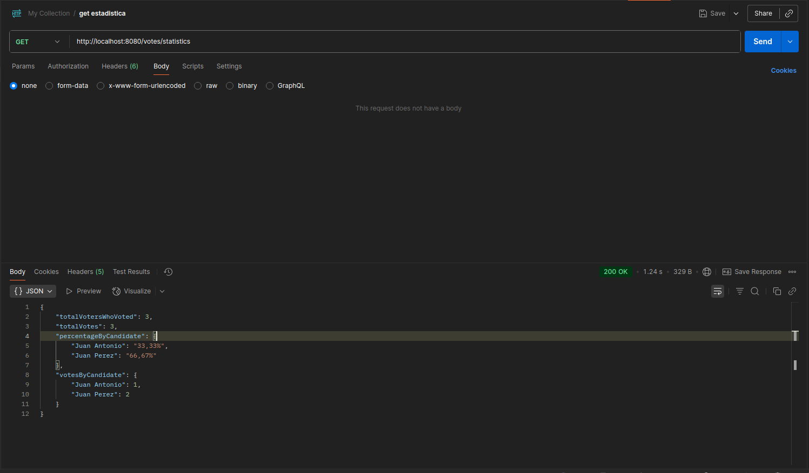

# Sistema de Votaciones API
Implementa una API RESTful para gestionar un sistema de votaciones. 
La API permite registrar votantes y candidatos, emitir un voto único por votante y obtener estadísticas de la votación en tiempo real.

## Instrucciones para Ejecutar Localmente
git clone https://github.com/AlejandroVelasquezDev/sistema-votos.git

### Ejecutar la aplicación:
mvn spring-boot:run

### Ejemplos de Uso de la API (con Postman)

La documentación completa de la API está disponible en Swagger UI una vez que la aplicación esté corriendo en http://localhost:8080/swagger-ui.html. 
A continuación, se muestran ejemplos de cómo interactuar con los endpoints principales.

### Registrar un Votante
Endpoint: POST http://localhost:8080/voters

Body (JSON):

{
"name": "Juan Garcia",
"email": "juan.garcia@example.com"
}

### Registrar un Candidato
Endpoint: POST http://localhost:8080/candidates

Body (JSON):

{
"name": "Maria Lopez",
"party": "Partido de la Gente"
}

### Emitir un Voto
Endpoint: POST http://localhost:8080/votes

Query Params:

voterId: ID del votante (ej. 1)

candidateId: ID del candidato (ej. 1)

### Capturas de Estadísticas

Al acceder al endpoint http://localhost:8080/votes/statistics ,  se obtiene un resumen de los resultados de la votación en formato JSON.

{
"totalVotersWhoVoted": 3,
"totalVotes": 3,
"percentageByCandidate": {
"Juan Antonio": "33,33%",
"Juan Perez": "66,67%"
},
"votesByCandidate": {
"Juan Antonio": 1,
"Juan Perez": 2
}
}

### captura de pantalla

